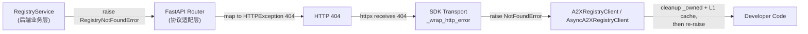
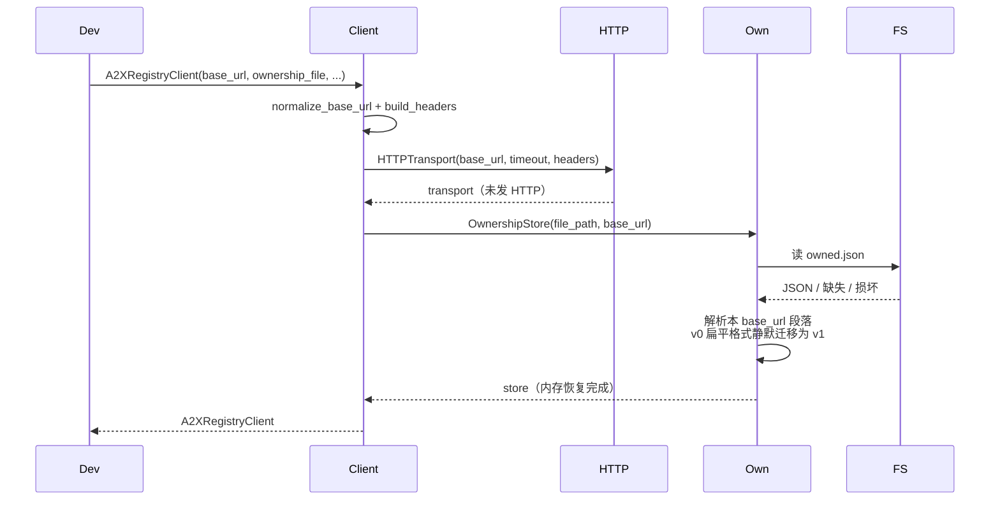
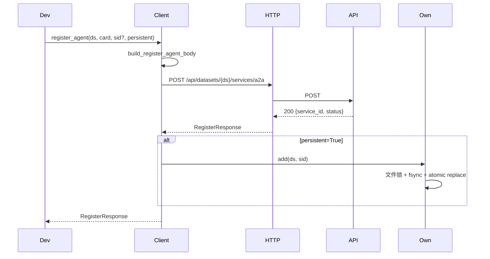
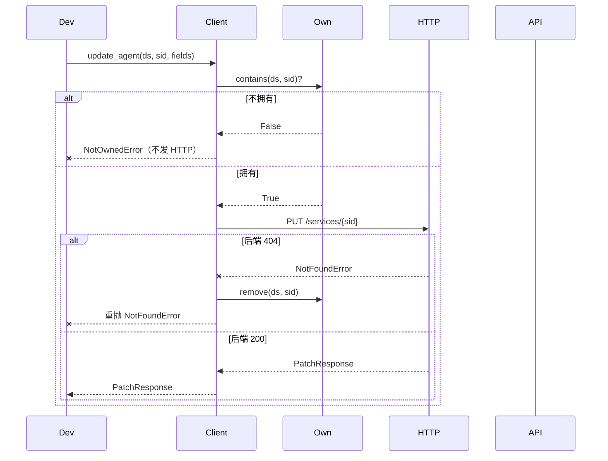
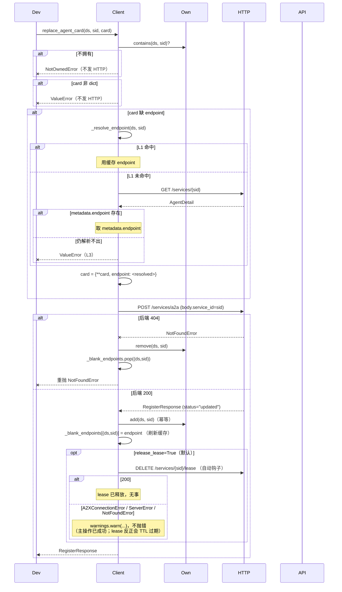
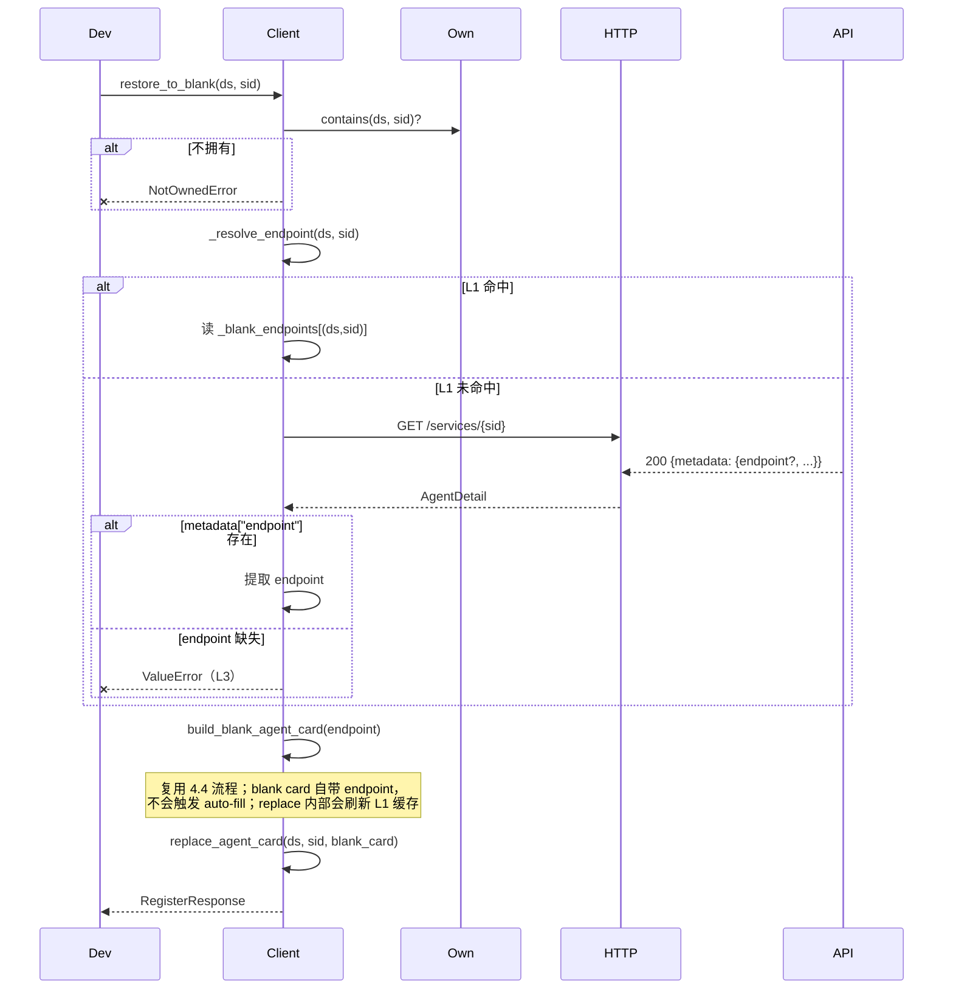
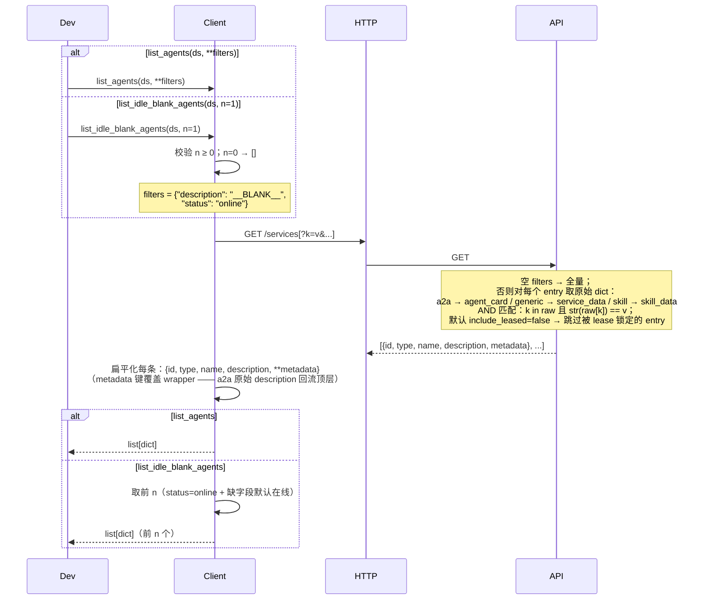
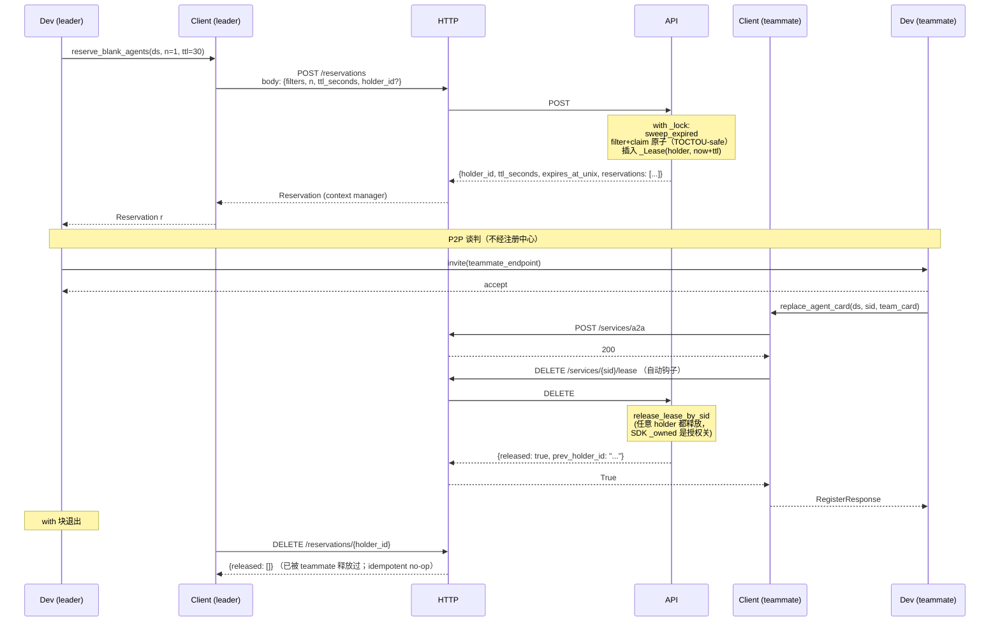

# A2X Registry Client SDK

A2X Registry 的 Python 客户端 SDK，把对 FastAPI 后端的 HTTP 请求包装成类型清晰、幂等安全的方法。

## 安装

暂未发布到 PyPI，从 GitHub tag 直接安装：

```bash
pip install git+https://github.com/Weizheng96/A2X-registry-client.git@v0.1.5
```

Python ≥ 3.10，运行时仅依赖 `httpx`。

---

## 1. 整体介绍

**首要场景**：**Agent Team 动态组队** —— 每个 Agent 以"空白 agent"身份进入空闲池；leader 通过预订（reservation lease，默认 30s 锁定）抢到候选；leader 与 teammate 走 P2P 协议谈判；teammate 接受后自己更新 card 的 `status`（`online` / `busy` / `offline`）并把 lease 还回去；解散后 teammate 恢复空白。SDK 提供 6 个团队原语：blank 注册 / 空闲发现 / **预订 / 释放 / 续期 / 自释放** / 整体覆盖 / 恢复空白。

**同步 + 异步双入口**：

| 入口 | 底层 |
|------|------|
| `A2XRegistryClient` | `httpx.Client` |
| `AsyncA2XRegistryClient` | `httpx.AsyncClient` |

方法名、参数、返回类型、异常体系完全对称；async 版每个方法以 `async def` 定义，关闭方法为 `aclose()`。

**独立分发约束**：SDK 自包含，仅依赖 `httpx`（Python ≥ 3.10），不引用其他模块。使用 `from a2x_registry_client import ...`。

---

## 2. 如何使用

### 2.1 经典流程代码

团队组队是 **两个独立进程协作** 的流程：teammate 把自己挂进空闲池，teamleader 发现并发起 P2P 协商，双方完成组队后各自更新自身状态，最后 teammate 退出时自行注销。下面按角色分两份示例展示。

#### 一次性 setup（管理员，可选）

如果想用非默认的 embedding 模型或 formats，由管理员先显式创建：

```python
from a2x_registry_client import A2XRegistryClient

admin = A2XRegistryClient(base_url="http://127.0.0.1:8000")
admin.create_dataset("team_pool", embedding_model="bge-small-zh-v1.5")
admin.close()
```

不需要自定义时这一步可以**跳过** —— teammate 第一次注册时后端会自动用默认配置创建 dataset。事后想换 embedding 模型可调 `POST /api/datasets/{ds}/vector-config`。

#### Teammate 视角（`teammate_node.py`）

```python
from pathlib import Path
from a2x_registry_client import A2XRegistryClient

# 每个 teammate 进程用独立的 ownership 文件，避免互相干扰
client = A2XRegistryClient(
    base_url="http://127.0.0.1:8000",
    ownership_file=Path("/var/run/a2x_teammate1.json"),
)

# 注册为空白 agent，进入空闲池
# 如果 team_pool 这个 dataset 不存在，后端会用默认配置自动创建
# 默认 embedding 模型是 all-MiniLM-L6-v2，三种格式都允许；事后可改
resp = client.register_blank_agent("team_pool", endpoint="http://teammate_1:8080")
my_sid = resp.service_id

# 等待 teamleader 通过 P2P 协议发来组队邀请，业务层代码，不经注册中心
p2p_wait_for_team_invitation()

# 接受邀请后，把自己的 card 覆盖成团队角色，状态改为 busy
# endpoint 不传时 SDK 会从本地缓存自动补上
client.replace_agent_card("team_pool", my_sid, {
    "name": "Task Planner (team-1)",
    "description": "负责拆解任务",
    "status": "busy",
    "skills": [{"name": "plan", "description": "子任务拆解"}],
})

# 执行团队任务，等待 teamleader 通知解散，业务层代码，不经注册中心
p2p_wait_for_disband()

# 解散后恢复为空白 agent，重新进入空闲池
client.restore_to_blank("team_pool", my_sid)

# 进程退出前注销自己，把 sid 从注册中心移除
client.deregister_agent("team_pool", my_sid)
client.close()
```

#### Teamleader 视角（`teamleader_node.py`）

```python
from a2x_registry_client import A2XRegistryClient

# leader 不注册任何 agent，纯发现 + 协调，ownership_file=False 跳过持久化
client = A2XRegistryClient(base_url="http://127.0.0.1:8000", ownership_file=False)

# 预订 1 个空闲 blank agent，30 秒内其他 leader 看不到这个 sid
reservation = client.reserve_blank_agents("team_pool", n=1, ttl_seconds=30)
if not reservation.agents:
    client.close()
    return  # 池里暂时没人，稍后重试

teammate = reservation.agents[0]  # 扁平 dict：id / type / name / description / endpoint / ...
teammate_endpoint = teammate["endpoint"]

# 向 teammate 发起 P2P 组队请求，失败则立刻释放 lease 让位给其他 leader
if not p2p_send_team_invitation(teammate_endpoint):
    client.release_reservation(reservation)
    client.close()
    return

# 与 teammate 协作完成任务
# teammate 在接受邀请时已经调过 replace_agent_card，自动钩子把 lease 释放了
do_collaborative_work(teammate_endpoint)

# 任务结束，通知 teammate 解散，teammate 会自己调 restore_to_blank 回池
p2p_send_disband_request(teammate_endpoint)
client.close()
```

**关键边界**：

- `replace_agent_card` 和 `restore_to_blank` 必须由 teammate 自己调用。SDK 的 ownership 检查只允许谁注册的谁修改，leader 没有 ownership，调用会本地 fail-fast 抛 `NotOwnedError`。
- P2P 组队邀请和解散通知都不经注册中心，是 teammate 和 leader 之间的 A2A 协议直连。注册中心只负责发现、状态广告和 lease 锁。
- Lease 释放时机：teammate 的 `replace_agent_card` 自动钩子会释放 lease，leader 端不必再显式调 `release_reservation`。失败路径下 leader 应主动调 `release_reservation` 让位，否则要等 30 秒 TTL 过期。
- 不需要 lease 锁的轻量场景仍可用 `client.list_idle_blank_agents("team_pool")`，但有双重分配风险，新代码建议默认用 `reserve_blank_agents`。

#### 异步版

`AsyncA2XRegistryClient` 一对一镜像 `A2XRegistryClient`，方法名 / 参数 / 返回类型完全一致。改动只有两处：每个方法调用前加 `await`，关闭方法 `client.close()` 改成 `await client.aclose()`。其他逻辑无变化。

### 2.2 全部 method 解释

`A2XRegistryClient` 共 18 个对外方法（含 `__init__` 与 `close`）。`AsyncA2XRegistryClient` **一对一镜像**，仅 `close` → `aclose`、调用形式改为 `await client.method(...)`；方法名、参数、返回类型、异常一致。下文仅列同步版。

**通用异常**（每个方法都可能发生，不重复列出）：
- `A2XConnectionError` — 网络 / 超时
- `A2XError` — 基类兜底

完整异常层级：

```
A2XError
├── A2XConnectionError                网络 / 超时
├── A2XHTTPError                      4xx/5xx 通用
│   ├── NotFoundError                 404
│   ├── ValidationError               400 / 422
│   │   └── UserConfigServiceImmutableError   user_config 来源不可改
│   ├── UnexpectedServiceTypeError    get_agent 收到非 JSON（skill ZIP）
│   └── ServerError                   5xx
└── NotOwnedError                     本地所有权校验失败，未发 HTTP
```

---

#### `__init__(base_url, timeout, api_key, ownership_file)`

构造客户端。不发 HTTP，仅建连接池 + 从磁盘恢复 `_owned`。

| 参数 | 类型 | 默认 | 说明 |
|------|------|------|------|
| `base_url` | `str` | `"http://127.0.0.1:8000"` | 自动补尾斜杠，支持子路径挂载 |
| `timeout` | `float` | `30.0` | HTTP 超时（秒） |
| `api_key` | `str \| None` | `None` | 非空时加请求头 `Authorization: Bearer ...` |
| `ownership_file` | `Path \| str \| False \| None` | `None` | `None`=`~/.a2x_registry_client/owned.json`；`False`=仅内存；其他=显式路径 |

**返回**：`A2XRegistryClient`
**错误**：无（磁盘读失败降级为 warning）

---

#### `create_dataset(name, embedding_model, formats)`

创建数据集。SDK 默认 `formats={"a2a":"v0.0"}`（Agent Team 场景）；显式传 `None` 则省略，由后端三种类型全开。

**输入**：
- `name: str`
- `embedding_model: str = "all-MiniLM-L6-v2"`
- `formats: dict | None` — 允许的注册格式；省略走 SDK 默认

**返回**：`DatasetCreateResponse(dataset, embedding_model, formats, status)`
**错误**：`ValidationError`（名字非法 / formats 规范化后为空）

---

#### `delete_dataset(name)`

删除数据集全部数据。成功或 400（已不存在）都会清本地 `_owned[name]`。

**输入**：`name: str`
**返回**：`DatasetDeleteResponse(dataset, status)`
**错误**：`ValidationError`（数据集不存在）

---

#### `register_agent(dataset, agent_card, service_id=None, persistent=True)`

注册 A2A Agent。`agent_card` dict 整体透传后端。`persistent=True` 时成功后写入 `_owned`。

**输入**：
- `dataset: str`
- `agent_card: dict` — 至少含 `name` + `description`
- `service_id: str | None` — 省略由后端 `generate_service_id("agent", name)` 派生（SHA256 前 16 hex）
- `persistent: bool = True`

**返回**：`RegisterResponse(service_id, dataset, status)`，`status ∈ {"registered","updated"}`
**错误**：`ValidationError`（card 格式校验失败 / 数据集不存在 / 该类型未允许）

---

#### `update_agent(dataset, service_id, fields)`

部分字段更新（PUT 顶层 upsert，**只增不减**）。

**输入**：
- `dataset: str`
- `service_id: str`
- `fields: dict` — 任意 `{field: value}`

**返回**：`PatchResponse(service_id, dataset, status, changed_fields, taxonomy_affected)`
**错误**：
- `NotOwnedError` — sid 不属于本客户端（本地 fail-fast，**不发 HTTP**）
- `NotFoundError` — 后端 404;自动清 `_owned` 后重抛
- `ValidationError` — 未知字段 / 改名冲突
- `UserConfigServiceImmutableError` — 服务源于 `user_config.json`

---

#### `set_status(dataset, service_id, status)`

把 agent card 的 `status` 字段置为指定枚举值。Eureka 风格的可用性意图。

**输入**：
- `dataset: str`
- `service_id: str`
- `status: str` — 必须是 `"online"` / `"busy"` / `"offline"` 之一（本地 enum 校验）

**返回**：`PatchResponse`，`changed_fields=["status"]`，`taxonomy_affected=False`
**错误**：
- `ValueError` — status 非合法 enum 值（本地，先于 ownership 校验）
- `NotOwnedError` / `NotFoundError` — 同 `update_agent`

> **注**：替代了原 `set_team_count` —— `status` 比 `agentTeamCount` 更通用（既能表达忙闲，也能表达短暂掉线 / 维护下线等未来状态）。

---

#### `list_agents(dataset, **filters)`

列出服务，可选按字段等值筛选（直接打到 `GET /services?<filters>`）。**不传 filters** → 返回全部服务；**传 filters** → AND 语义、字符串等值。

**匹配目标**：后端对每个服务按类型取"原始 dict" —— a2a → `entry.agent_card`（原始 `description`，无 `build_description` 转换）；generic → `entry.service_data`；skill → `entry.skill_data`。字段**必须存在且值相等**才命中。

**输入**：
- `dataset: str`
- `**filters: Any` — 可省；键不能是 `fields` / `page` / `size`（保留参数）；值不能是 `None`；列表/dict 类型不支持（query param 无法表达）

**返回**：`list[dict]` — 每项是扁平化的 `{id, type, name, description, ...card_fields}`。`metadata` 内的字段被合并上来，对 a2a 顶层 `description` 是**原始** card 描述（不是 `build_description` 加工后的那个）。对 generic/skill，wrapper 的 name/description 被保留（metadata 本来就没 name/description）。

**错误**：
- `ValueError` — filter 用了保留键 / None 值 / 空字符串键（本地）

**示例**：

```python
# 列出全部
all_svcs = client.list_agents("team_pool")
for s in all_svcs:
    print(s["id"], s["type"], s["name"])

# 按单字段
blanks = client.list_agents("team_pool", description="__BLANK__")

# 复合条件
free_blanks = client.list_agents("team_pool",
                                 description="__BLANK__", status="online")
```

---

#### `get_agent(dataset, service_id)`

单个服务完整信息（`GET /services/{service_id}`，path-based）。

**输入**：
- `dataset: str`
- `service_id: str`

**返回**：`AgentDetail(id, type, name, description, metadata, raw)` — `metadata` 是完整 Agent Card，`raw` 保留原始响应
**错误**：
- `NotFoundError` — sid 不存在
- `UnexpectedServiceTypeError` — 服务是 skill 类型（后端返回 ZIP）

---

#### `deregister_agent(dataset, service_id)`

注销服务。成功后清本地 `_owned` + L1 endpoint 缓存。

**输入**：
- `dataset: str`
- `service_id: str`

**返回**：`DeregisterResponse(service_id, status)`，`status` 仅 `"deregistered"`（不存在的 sid 走 `NotFoundError` 分支，**不会返回 200 + `"not_found"`**）
**错误**：
- `NotOwnedError` — 本地未拥有
- `NotFoundError` — 后端 404（业务层 `RegistryNotFoundError` → 路由 404 → SDK `NotFoundError`，自动清本地后重抛）

---

#### `register_blank_agent(dataset, endpoint, service_id=None, persistent=True)`

薄壳于 `register_agent`，构造 blank 模板：

```json
{"name": "_BlankAgent_<endpoint>", "description": "__BLANK__", "endpoint": "<endpoint>", "status": "online"}
```

成功后把 `(dataset, sid) → endpoint` 写入 L1 内存缓存，供 `restore_to_blank` 使用。同 endpoint 重复注册幂等（sid 基于 name 的 SHA256）。

**输入**：
- `dataset: str`
- `endpoint: str` — 非空字符串
- `service_id: str | None`
- `persistent: bool = True`

**返回**：`RegisterResponse(service_id, dataset, status)`
**错误**：
- `ValueError` — endpoint 空/非字符串（本地）
- `ValidationError` — 同 `register_agent`

---

#### `list_idle_blank_agents(dataset, n=1)`

返回 N 个**真正空闲**的 blank agent。后端按 `description="__BLANK__"` **AND** `status="online"` 双条件过滤；SDK 默认 `n=1`（典型场景"取一个空闲队员"），可显式传入更大的 N。后端对 `status="online"` 应用 **default-online 规则**：缺 `status` 字段也算 online，所以升级前注册的、没 `status` 字段的 blank 仍能命中。

**调用方读法**（返回形状与 `list_agents` 一致）：

```python
# 默认取 1 个
agent = client.list_idle_blank_agents("team_pool")[0]
endpoint = agent["endpoint"]
sid      = agent["id"]

# 也可批量
for agent in client.list_idle_blank_agents("team_pool", n=3):
    ...
```

**输入**：
- `dataset: str`
- `n: int ≥ 0` — 默认 `1`

**返回**：`list[dict]` — 形状同 `list_agents`（扁平化的 `{id, type, name, description, ...card_fields}`）；**所有项 `status == "online"`**（或字段缺失，按默认值视作 online）
**错误**：`ValueError` — n 非法（本地）

---

#### `replace_agent_card(dataset, service_id, agent_card, release_lease=True)`

**整张覆盖** agent card（POST `/services/a2a` 同 sid → `_do_register` 全量替换 entry）。区别于 `update_agent` 的"只增不减"。

**Endpoint 自动补全**：如果 `agent_card` 缺 `endpoint` 字段（或字段为空 / 非字符串），SDK 自动从**上次的 endpoint** 补上 —— 走和 `restore_to_blank` 同款的三层回退（L1 内存缓存 → L2 `get_agent` → L3 `ValueError`）。意思是：调用方不必每次都把 endpoint 重新塞进去，原 endpoint 默认保留。**显式传 endpoint 则不触发自动补全**，按你给的值覆盖。

**自动 lease 释放钩子（`release_lease=True` 默认）**：成功 POST 后，SDK best-effort 调用 `release_my_lease(dataset, sid)` 释放任何被 leader reservation 锁住的 lease。客户场景下 teammate 在"完成 P2P 谈判 / 拆队"那一刻就该把 lease 还回去，自动钩子让这步无需调用方记忆。

钩子失败处理：
- HTTP 200（lease 已释放或本来就没有）→ 无事发生
- `A2XConnectionError` / `ServerError` / `NotFoundError`（旧后端没此路由）→ `warnings.warn(...)`，**不**抛错（主操作 `replace_agent_card` 本身已成功；lease 反正会 TTL 过期）
- 不会触发 `NotOwnedError`（前面 `_assert_owned` 已通过）

需要纯净的 replace 行为时传 `release_lease=False`。

本地校验顺序：
1. `service_id` 必须属于本客户端 → 否则 `NotOwnedError`（不发 HTTP）
2. `agent_card` 必须是 `dict` → 否则 `ValueError`（不发 HTTP）
3. 如果 endpoint 缺 → 自动补全（可能发 1 次 GET）→ 仍解析不出则 `ValueError`

成功后 L1 endpoint 缓存被刷新为最终用上的 endpoint。

**输入**：
- `dataset: str`
- `service_id: str`
- `agent_card: dict` — `endpoint` 字段可省（自动补全）
- `release_lease: bool = True` — 是否在 POST 成功后自动调用 `release_my_lease`

**返回**：`RegisterResponse(service_id, dataset, status="updated")`
**错误**：
- `NotOwnedError` — sid 不属于本客户端（本地，最先触发）
- `ValueError` — `agent_card` 非 dict，或 endpoint 自动补全失败
- `NotFoundError` — 后端 404（auto-fill 的 GET 或最终 POST）；自动清 `_owned` + L1 缓存后重抛
- `ValidationError` — 后端 card 格式校验失败

---

#### `restore_to_blank(dataset, service_id)`

恢复为空白 agent（= 用 blank 模板调 `replace_agent_card`）。Endpoint 三层回退：

| 层级 | 数据源 | 何时命中 |
|------|--------|----------|
| L1 | 进程内缓存 `_blank_endpoints[(ds,sid)]` | 同进程 register → replace → restore，**0 次额外 HTTP** |
| L2 | `get_agent` 读 `metadata["endpoint"]` | 进程重启 / 缓存清空；依赖上游调用方在 replace 时保留 endpoint |
| L3 | `ValueError` | card 丢失 `endpoint` 字段（契约违反） |

**输入**：
- `dataset: str`
- `service_id: str`

**返回**：`RegisterResponse`
**错误**：
- `NotOwnedError` — 本地未拥有
- `ValueError` — L3 触发
- `NotFoundError` — L2 的 GET 或最终 POST 时 404

---

#### `reserve_blank_agents(dataset, n=1, ttl_seconds=30, holder_id=None, extra_filters=None)`

Leader-side 预订：从 idle pool 锁定 `n` 个 blank agents，时长 `ttl_seconds`。锁定期内，其他 leader 通过 `list_idle_blank_agents` / `reserve_blank_agents` 看不到这些 agent，避免双重分配。

默认 filter 是 `description=__BLANK__ AND status=online`，可通过 `extra_filters` 追加任意字段。`holder_id=None` 时 SDK 让后端自动生成 `holder_<uuid>`；跨进程协调可显式传同一 ID。

返回的 `Reservation` 是 **context manager**（同步 `with` / 异步 `async with`），退出时 best-effort 释放 lease —— 谈判失败时不必手动清理：

```python
with client.reserve_blank_agents("team_pool", n=1) as r:
    teammate = r.agents[0]
    if negotiate_p2p(teammate):
        client.replace_agent_card(...)   # 成功；自动钩子顺手把 lease 释放了
    # 失败 → with 退出 → release_reservation → leader 立刻让位
```

**输入**：
- `dataset: str`
- `n: int >= 0`（默认 1）
- `ttl_seconds: int >= 1`（默认 30）
- `holder_id: str | None`
- `extra_filters: dict | None`

**返回**：`Reservation(holder_id, dataset, ttl_seconds, expires_at_unix, agents)`
**错误**：
- `ValueError` — `n` 或 `ttl_seconds` 非法（本地，无 HTTP）
- `A2XConnectionError` / `A2XHTTPError` — 网络 / 后端错

---

#### `release_reservation(reservation, service_ids=None)`

Leader-side 释放：

- `service_ids=None` → 释放该 holder 在 dataset 内的**全部** lease（DELETE `/reservations/{holder_id}`）
- `service_ids=[...]` → 仅释放指定 sid（DELETE `/reservations/{holder_id}/{sid}` 每 sid 一次）

幂等：未持有的 sid 静默跳过。释放后将 `reservation._released = True`，context manager 退出变成 no-op。

返回实际释放的 sid 列表。其他 holder 持有的 sid 触发 `403 → A2XHTTPError`。

---

#### `extend_reservation(reservation, ttl_seconds=30)`

延长该 holder 全部 lease 的 TTL。返回新的 `expires_at_unix`，并更新 `reservation.expires_at_unix` / `reservation.ttl_seconds`。

如果 lease 已过期（已被 sweep）→ `NotFoundError(404)`，明确表示"工作窗口已丢失"——避免悄悄复活已超时的预订。

---

#### `release_my_lease(dataset, service_id)`

Teammate-self 释放：释放任何 holder 在自己 sid 上的 lease（DELETE `/services/{sid}/lease`）。无需知道 holder_id —— 因为 leader 是通过 HTTP 把 lease 注册到 backend，而不是通过 P2P 告诉 teammate。

授权由 SDK 的 `_owned` 检查兜底（必须是本客户端注册的 sid，否则 `NotOwnedError`，不发 HTTP）。

返回 `True` 如果有 lease 被释放，`False` 如果根本没 lease（idempotent）。

`replace_agent_card` 默认会自动调用此方法 —— 一般不需要显式调。

---

#### `close()` / `__enter__` / `__exit__`

关闭底层 `httpx.Client` 连接池。支持上下文管理器：

```python
with A2XRegistryClient(...) as client:
    client.register_blank_agent(...)
# 退出时自动 close()
```

异步版对应 `aclose()` + `__aenter__` / `__aexit__`。

---

## 3. 整体架构

### 3.1 模块划分

```
a2x_registry_client/
├── __init__.py       # 导出 A2XRegistryClient / AsyncA2XRegistryClient / 异常 / dataclass
├── client.py         # A2XClient（同步入口）
├── async_client.py   # AsyncA2XClient（异步镜像）
├── transport.py      # HTTPTransport + AsyncHTTPTransport
├── ownership.py      # OwnershipStore（文件持久化 + 跨进程锁）
├── _internal.py      # 共享纯函数：URL / body / 校验 / 哨兵
├── models.py         # 响应 dataclass
└── errors.py         # 异常层级
```

**独立性自检**：`grep -rE "^(from|import) " a2x_registry_client/ | grep -v "^[^:]*:(from \.|from __future__|import (httpx|json|os|sys|asyncio|warnings|threading|contextlib|pathlib|typing|dataclasses|urllib))"` 应无命中 —— 即仅依赖 `httpx` 与标准库。

### 3.2 职责分层

| 模块 | 职责 | 依赖 |
|------|------|------|
| `client.py` / `async_client.py` | **业务编排**：参数校验、ownership 前置检查、响应解析、404/400 自动清本地 | `_internal` / `transport` / `ownership` / `models` / `errors` |
| `transport.py` | **HTTP 出口**：唯一网络入口；4xx/5xx 通过 `_wrap_http_error` 映射为 `A2XError` 子类 | `httpx` / `errors` |
| `ownership.py` | **本地状态 + 持久化**：内存 `{ds: {sid}}`；跨平台文件锁（POSIX `fcntl.flock` / Windows `msvcrt.locking`）+ `fsync` + atomic replace | stdlib |
| `_internal.py` | **共享纯函数**：URL 拼接、body 构造、blank card 模板、`endpoint` 字段校验、哨兵 | `httpx`（仅类型标注） |
| `models.py` | **响应 dataclass**：`from_dict` 容忍未知字段；`AgentDetail.raw` 保留原响应 | stdlib |
| `errors.py` | **异常层级**：基类 `A2XError` 携带 `status_code` / `payload` | stdlib |

**边界**：`client.py` 不直接 `httpx`、不做文件 I/O；`transport.py` 不知道"所有权"和数据模型；`ownership.py` 不知道 HTTP。

### 3.3 所有权与状态

`OwnershipStore` 维护 `_owned: {dataset: {service_id}}`，记录本客户端注册过的服务，默认持久化到 `~/.a2x_registry_client/owned.json`。

| 方法 | 写 `_owned` | 读 `_owned` |
|------|:-:|:-:|
| `register_agent(persistent=True)` / `register_blank_agent(persistent=True)` | ✅ | — |
| `register_agent(persistent=False)` / `register_blank_agent(persistent=False)` | — | — |
| `update_agent` / `set_status` | — | ✅ `NotOwnedError` |
| `replace_agent_card` / `restore_to_blank` | ✅（幂等） | ✅ 同上 |
| `deregister_agent` | 成功后移除 | ✅ 同上 |
| `release_my_lease` | — | ✅ 同上（teammate 只能释放自己 sid 上的 lease） |
| `delete_dataset` | 成功/400 均清整段 | — |
| `list_agents` / `list_idle_blank_agents` / `get_agent` / `create_dataset` / `__init__` | — | — |
| `reserve_blank_agents` / `release_reservation` / `extend_reservation` | — | — |（leader 不必拥有候选，授权由 holder_id 兜底）

**自动同步本地与远端**：mutation 命中后端 404 → 自动 `_owned.remove(sid)` 再重抛 `NotFoundError`；`delete_dataset` 命中 400 同理。避免"永远 404 + 本地永远脏"。

**L1 endpoint 缓存**（独立于 `_owned`）：`_blank_endpoints: {(ds, sid): endpoint}`，仅内存、不持久化。**写入方**：`register_blank_agent`、`replace_agent_card`（成功后刷新为新 card 的 endpoint）；**读取方**：`replace_agent_card`（auto-fill 缺失 endpoint）、`restore_to_blank`（构建 blank 模板）。`deregister_agent` / `replace_agent_card` 404 时一并清理。

### 3.4 NotFound 分层错误约定

`update_agent` / `set_status` / `deregister_agent` 等 mutation 在"目标 service 不存在"时遵循三层契约：



| 层 | 抛出 | 职责 |
|---|------|------|
| `RegistryService`（后端业务层） | `RegistryNotFoundError`（见 [A2X-registry/src/register/errors.py](https://github.com/Weizheng96/A2X-registry/blob/main/src/register/errors.py)） | 只表达"业务上找不到"，不持有 HTTP 语义、不依赖 web 框架 |
| FastAPI Router（协议层） | `HTTPException(404, ...)` | 把业务异常翻译成统一 HTTP 状态码（见 [A2X-registry/src/backend/routers/dataset.py](https://github.com/Weizheng96/A2X-registry/blob/main/src/backend/routers/dataset.py) 的 `_run` 包装器内） |
| SDK Transport（Python 层） | `NotFoundError` | 反向把 HTTP 404 映射成 SDK 异常 |
| A2XClient（业务方法层） | 重抛前清本地 `_owned` / L1 缓存 | 自动维护本地与远端的一致性 |

**设计原则**：

- **业务层不直接抛 `HTTPException`** —— 否则 `RegistryService` 依赖 `fastapi`，无法独立测试或被非 web 调用方复用
- **业务层不用裸 `KeyError`** —— 语义太泛（任何 `dict[bad_key]` 也会触发），且 `str(KeyError(...))` 文案带额外引号
- **不存在 → 404，而非 200 + `status="not_found"`** —— 否则 SDK 不能稳定触发 `NotFoundError` 分支与 ownership 自动清理；调用方还得多写一层 `if resp.status == "not_found":`

**调用链**：

1. `RegistryService.deregister(...)` 发现 sid 不存在 → 抛 `RegistryNotFoundError`
2. Router `_run` 捕获 → `HTTPException(status_code=404, detail=str(exc))`
3. SDK transport `_wrap_http_error` → `NotFoundError(message, status_code=404, payload={"detail": ...})`
4. `A2XRegistryClient.deregister_agent` 捕获 `NotFoundError` → `_owned.remove(...)` + `_blank_endpoints.pop(...)` → 重抛
5. 调用方按业务需要处理 `NotFoundError`（或继续上抛）

---

## 4. 对外接口 → 内部调用时序图

**图例**：`Dev` 调用方 · `Client` A2XRegistryClient · `Own` OwnershipStore · `HTTP` HTTPTransport · `API` FastAPI 后端 · `FS` 本地文件系统

**异步版差异**：`Client → HTTP` 所有调用前加 `await`；`Own` 的写操作通过 `await asyncio.to_thread(...)` 调度；只读 `contains` 仍同步。

仅画 6 个关键流程。未画方法的流程与其底层方法一致：`register_blank_agent` ≈ 4.2；`set_status` ≈ 4.3；`get_agent` 是直连 GET；`delete_dataset` / `deregister_agent` 与 4.3 的 404 自清模式相同。

### 4.1 `__init__`

不发 HTTP，仅建连接池 + 从磁盘恢复 `_owned`。



### 4.2 `register_agent`

`register_blank_agent` 是其薄壳（先构造 blank card，注册成功后额外记 L1 endpoint 缓存）。



### 4.3 `update_agent`

带 ownership fail-fast 和 404 自清。`set_status` 完全同构，仅 body 固定为 `{"status": <enum>}`。



### 4.4 `replace_agent_card`

整张覆盖 + endpoint 自动补全。Ownership 最先检查；缺 endpoint 时走 L1→L2 回退；404 自动清 L1 缓存。



### 4.5 `restore_to_blank`

L1 → L2 → L3 的 endpoint 回退链，末尾复用 `replace_agent_card`。



### 4.6 `list_agents` / `list_idle_blank_agents`

`list_agents` 一次 HTTP，可选过滤；`list_idle_blank_agents` 是在此基础上本地排序 + 取前 N 的薄壳。



### 4.7 `reserve_blank_agents` / `release_my_lease`

Lease 是 SQS visibility-timeout 风格的内存级短锁。`reserve` 在后端 `_lock` 内做"过滤+认领"原子操作，避免 leader 间双重分配。`Reservation` 是 context manager，退出时 best-effort 释放（idempotent）。



**失败路径**：谈判超时 / teammate 拒绝 / Leader 端异常 → `with` 退出仍会调 `release_reservation`，立刻把 lease 还回池里，其他 leader 可立刻重试（无需等 30s TTL）。

---

## 相关

- **后端仓库**：[A2X-registry](https://github.com/Weizheng96/A2X-registry) — 本 SDK 对接的 FastAPI 后端
- **许可证**：[MIT](LICENSE)
